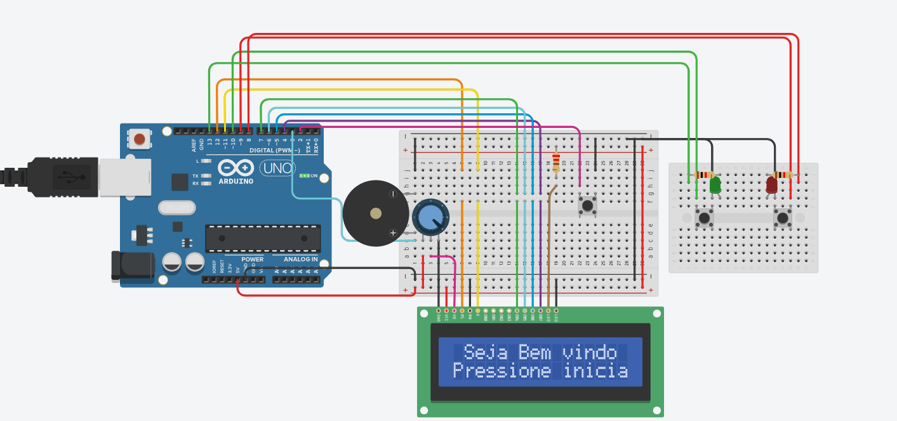

# Jogo de Memória e Perguntas em Arduino

Este projeto foi desenvolvido como parte de um trabalho da faculdade FEI. Consiste em um jogo implementado com Arduino que possui duas fases: um jogo de memória com LEDs e um jogo de perguntas com respostas de sim/não.

## Link do Projeto no Tinkercad

Você pode acessar o circuito e a simulação do projeto no Tinkercad clicando no link abaixo:

[Jogo de Arduino - Simulação no Tinkercad](https://www.tinkercad.com/things/fL2FE5O3fUw-jogo-arduino?sharecode=6uSYjramlLTqF8oCIIy6r9clfH3LyNMMoarauO4mZpI)
## Sumário

- [Visão Geral](#visão-geral)
- [Componentes Utilizados](#componentes-utilizados)
- [Como Funciona o Jogo](#como-funciona-o-jogo)
  - [Fase 1: Jogo de Memória](#fase-1-jogo-de-memória)
  - [Fase 2: Jogo de Perguntas](#fase-2-jogo-de-perguntas)
- [Instruções de Uso](#instruções-de-uso)
- [Código](#código)
- [Autores](#autores)

## Visão Geral

Este projeto implementa um jogo interativo utilizando LEDs, botões, um display LCD e um buzzer. Ele é dividido em duas fases:

1. **Jogo de Memória (Estilo "Genius")**: O jogador deve memorizar e repetir uma sequência de LEDs.
2. **Jogo de Perguntas (Sim/Não)**: O jogador responde a perguntas aleatórias de sim/não dentro de um limite de tempo.

## Componentes Utilizados

- 1 Arduino Uno
- 2 LEDs (vermelho e verde)
- 3 Botões (para interação com o jogo)
- 1 Potenciômetro
- 1 Buzzer (para efeitos sonoros)
- 1 Display LCD 16x2

## Botão de Início e Reinicialização

- Um dos botões é dedicado apenas para **iniciar o jogo**. Caso esse botão seja pressionado enquanto o jogo está em execução, o Arduino será reiniciado automaticamente, e o jogo começará do início.

## Como Funciona o Jogo

### Fase 1: Jogo de Memória

O jogo começa com o Arduino exibindo mensagens no LCD e piscando LEDs em uma sequência aleatória, semelhante ao jogo "Genius". O jogador deve memorizar essa sequência e, em seguida, repeti-la usando dois botões, um para o LED verde e outro para o LED vermelho. Se o jogador errar a sequência, o Arduino toca um som de erro e o jogo reinicia.

**Regras da Fase 1:**
- O jogador deve repetir a sequência exibida pelo Arduino.
- Para cada acerto, o buzzer toca um som de confirmação.
- Se o jogador errar, o jogo reinicia e toca um som de erro.

### Fase 2: Jogo de Perguntas

Se o jogador completar a fase de memória com sucesso, ele avança para a fase de perguntas. O Arduino fará perguntas aleatórias com respostas de sim/não, e o jogador deve responder pressionando o botão correto. O jogador tem 10 segundos para responder cada pergunta. Se o tempo acabar ou o jogador errar, ele perde uma chance, podendo pular uma pergunta.

**Regras da Fase 2:**
- O jogador tem 10 segundos para responder a cada pergunta.
- Se e somente se, o tempo acabar, o jogador pode pular a pergunta uma vez, mas a ultima questão não pode ser pulada.
- Se o jogador errar uma vez ou deixar o tempo passar duas vezes, o jogo reinicia totalmente

  
## Instruções de Uso

1. Carregue o código no Arduino.
2. Conecte os componentes de acordo com o esquema fornecido no código.
3. Pressione o botão de início para iniciar o jogo.
4. Na Fase 1, siga a sequência dos LEDs.
5. Na Fase 2, responda as perguntas de sim/não usando os botões.
6. Se desejar reiniciar o jogo a qualquer momento, pressione o botão de início.

## Código

O código do jogo foi desenvolvido em C++, utilizando a biblioteca `LiquidCrystal` para controlar o display LCD e a função `tone()` para controlar o buzzer.

## Autores

- Pedro Henrique Satoru
- Pedro Henrique Correa
